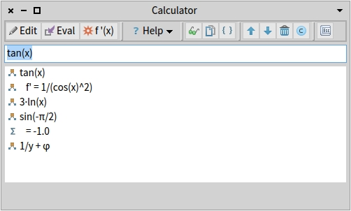
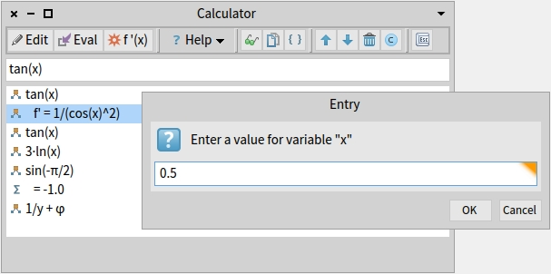
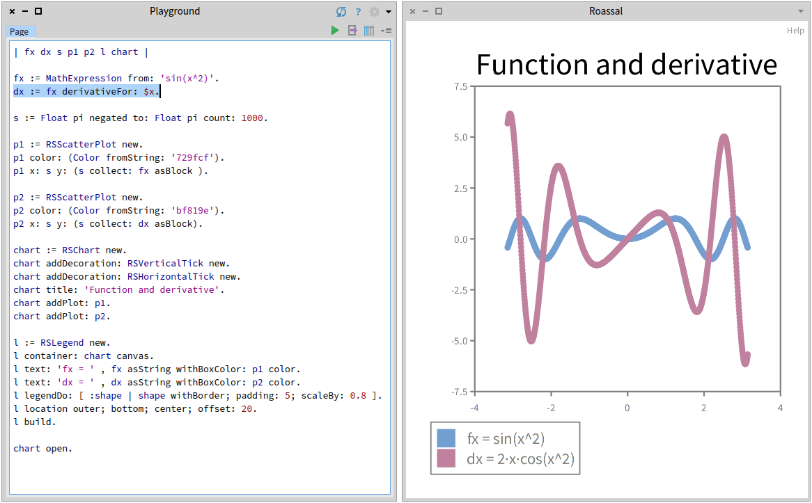

# Mathemagics

## Symbolic algebra package written in Pharo Smalltalk

Pharo Smalltalk is an expressive and powerful language, but when you just working with it, some things are rather puzzling:

* There is no built-in Calculator application. Smalltalk have the Playground but sadly the precedence of operands does not fully match Mathematics precedence (`1 + 2 * 3` returns 9 rather than 7).
* Missing leading zero `.45` is not supported although most people in finance are used to omit it, and other languages take that as default.
* Writing a number in scientific notation does not support decimal exponents `3e2.5` (Smalltalk returns 5).
* Some numbers become incorrect, for instance `3e-4` becomes `0.00030000000000000003`.
* Power and square are not quite compatible therefore `25 sqrt` returns `5` but `25 ** 0.5` returns `4.999999999999999`.
* Other cases such as `(Float pi / 2) tan` would return a huge number rather than 'Undefined' because `Float halfPi cos` is not exactly zero, but `Float halfPi sin` returns a perfect `1.0`. These results are confusing specially since Smalltalk can handle cases like `(1/3)*3` => `1` which other languages cannot handle.
* Smalltalk provides a way to simulate a mathematical function using a block `f := [ :x | 1 / x ]` which is quite neat. The block may get more complex if you use a function that is undefined for some values, such as Logarithm of a negative number, or division by zero.

So I embark myself into experimenting with an implementation of symbolic algebra for Smalltalk. Mathematics is a huge language in itself, and therefore there is an implicit scope on this project, but most algebra and a little of calculus has been implemented. New functions can be added with very little effort and without changing other classes, since the design contemplates ambiguity (unary or multiple function names), precedence, Smalltalk vs Math names, partial name match (#sqrt vs #sqr) and other problems have been solved.

## Why is called 'Mathemagics'?

Originally the package was meant to be called MathEx (short for Mathematical Expressions, and to match RegEx) but nowadays there is more functionality already available. Apart from Mathematical Expressions, the package has a parser, a calculator, a repository for formulas, and more to come in the future.

## Ok.. but what can I do with it?

A few examples of things you can do:

* Building expressions with Number-like messages

```Smalltalk
  "Notice ** gets replaced by ^ on printing, both accepted"
  MathExpVariable x ** 3 negated                                "x^-3"
```

* Building expressions with the new built-in parser

```Smalltalk
  MathExpressionParser new parse: 'x + 2'.                      "x + 2"
```

* Parse via expression, simplify, sort terms, use symbols (pi => π)

```Smalltalk
  | fx |
  "Notice pi gets represented with a symbol"
  fx := MathExpression from: 'x*x - (pi * -1) + x*8/1'.
  fx simplify.                                                  "x^2 + 8·x + π"
```

* Nested behaviour on simplification even on functions

```Smalltalk
  | fx |
  fx := MathExpression from: 'sin(x)*cos(x+x)/sin(sqr(x)/x)'.
  fx simplify.                                                  "cos(2·x)"
 ```

* Derivatives

```Smalltalk
  | fx dFx |
  fx := MathExpression from: 'x*x + ln(x)'.
  dFx:= fx derivativeFor: 'x'.                                  "2·x + 1/x"
```

* Variable extraction and evaluation

```Smalltalk
  | fx x |
  fx := MathExpression from: 'sqrt(x) + x*x*x + 1/x'.
  fx := fx simplify.                                            "√(x) + x^3 + 1/x"

  "expression with variables are not reduced to a Number"
  fx isNumber.                                                  "false"

  "Extract variable and evaluate for a number"
  x := fx variable: #x.
  x value: 5.
  fx asNumber.                                                  "127.43606797749979"
```

* Block generation

```Smalltalk
  "Expression to a Smalltalk BlockClosure"
  | fx x |
  "Math precedence means no parenthesis required"
  fx := MathExpression from: 'x + 3 * pi'.                      "x + π·3"

  "New method will generate code with Smalltalk precedence"
  fx asBlock                                                    "[ :x | x + (3 * Float pi) ]"
```

## What are the main components of this package?

There are 4 basic components:

1. **MathExpression:** *This class and its subclasses can represent any mathematical expression the user can write using a number, mathematical constants, operators and functions. A complex expression is built as a tree of mathematical expressions. This class is aligned with the Number class, so you will find familiar messages such as `+`, `#square`, `#isNumber`, `#asNumber`, `#positive`, etc. On top of those message you will find new functionality such as `#asPower`, `#simplify`, `#derivativeFor:`, `#dividend`, `#isFunction` and others. The subclasses prefix are shorten to 'MathExp' for simplicity reasons, but you shouldn't need to use them directly.*
   - Unary expressions (sin, cos, abs)
   - Binary expressions (power, log, addition)
   - Value holders (numbers, mathematical constants, variables)
   - Dependencies: `String`, `Number`, `Set`, `Dictionary`

2. **MathExpressionParser:** *This class analyses a text and return a MathExpression representing it. The parser uses Maths precedence (not Smalltalk precedence). The parser has a fully implemented non-greedy Infix notation (and it should be possible to extend for Postfix or Polish notations).*
   - Parser fits in just 1 class with barely 30 short methods
   - Dynamic analysis of MathExpression hierarchy determines parser capabilities
   - Uses Regular Expressions instead of parser generators to avoid external dependencies
   - The underlying implementation algorithm based on is Shunting Yard
   - Instantiates objects using `#perform` to run operations same way the user can do
   - Dependencies: `MathExpression` and subclasses, `String`, `Number`, `Dictionary`, `Regex`

3. **Calculator:** *This is a proxy to a simple Spec1 application (in the future can decide to call a Spec2 instead). It mainly contains an edit area, a results area, and a basic toolbar. The user types the expression so there is no need of buttons as in common calculators.*
   - Uses the parser and holds MathExpressions with their results
   - Displays the expression as close as possible the user entered (settings available)
   - Simplify the expression if possible (e.g.: User enters `x+x` it will display the input and `= 2*x`)
   - Evaluates the expression to a Number if possible (e.g.: User enters `2+pi+2` it will print `pi+4 = 7.1415..`)
   - It allows copying to clipboard, inspection and manipulation of results
   - Dependencies: `MathExpression`, `MathExpressionParser`, `Spec1` (atm).

4. **Formula Library:** *The idea is to have a simple repository of commonly used formulas that can be reused in the future.*
   - Class protocols becomes a classification mechanism: `Financial`, `Geometrical`, `Mathematical`, etc.
   - Formula parameters can be numbers or variables for further evaluation
   - Dependencies: `MathExpression`

## Highlighted features

Here are some of the most interesting methods available:

* `#isNumber`
    Answers if the expression can evaluate to a Smalltalk Number (expression has no variables unset and not undefined values).
* `#asNumber`
    Returns the numeric result of the expression as Smalltalk Number (including Fraction).
    Notice that square root provides one answer (`√25` = `+5`) but Math has two solutions (`-5`).
* `#simplify`
    Answers a new expression if the current one can be reduced to a simpler form.
    The new form is meant to be simpler to read. Long numbers are avoided.
* `#derivativeFor:`
    Answers a new expression that is the derivative for a Variable of the current expression.
* `#asBlock`
    Returns a BlockClosure that can be use inside other code such as Roassal.
* `#replace: with:`
    Replaces occurrences of the subexpression with another one.
* `#variables`
    Returns a list of all the variables in the expression.
* `#variable:`
    Returns the variable that has the specified symbol.
* `#sqr`
    Answers an expression raised to 2 using sqr function (non-standard)
* `#square`
    Answers an expression raised to 2.
* `#cubed`
    Answers an expression raised to 3 (non-standard)

## Examples using the package

* Calculator

    Editing formulas.

    

    Evaluating variables in a formula:

    

* Using the library with Roassal

    Demo code (text):

    ```Smalltalk
    | fx s p chart |

    fx := MathExpression from: 'pi-sin(abs(x))'.

    s := -10 to: 10 count: 1000.

    p := RSScatterPlot new.
    p color: (Color fromString: 'ce7e2d').
    p x: s y: (s collect: fx asBlock).     "generate block on the fly"

    chart := RSChart new.
    chart addDecoration: RSHorizontalTick new.
    chart title: 'Roassal & Mathemagics'.
    chart xlabel: fx asString.             "print the expression Math friendly"
    chart ylabel: fx asBlock asString.
    chart addPlot: p.
    chart open.
    ```

    Produces this result:

    

    Another example with generated derivative:

    

## Goals

Some of the reasons for the design:

**For MathExpression**
- [x] Represent any expression including variables ('x', 'y', etc) and mathematical constants (pi, e, phi), operands and functions
- [x] Evaluate an expression to a number when needed not only during creation
- [x] Allow to enter the expression and represent as closely as entered (e.g.: `sqr(25)` does not suddenly convert to `5`)
- [x] Support Simplification of an expression (e.g.: `x+x` => `2·x`)
- [x] Support Differentiation of an expression (e.g.: `(x^3)` derivative is `3·x^2`)
- [x] Print a mathematical expression to text (e.g.: `fx asString` => `2·x`)
- [x] Code a mathematical expression as a block (e.g.: `fx asBlock` => `[ :x | 2*x ]`)
- [x] Optionally use Math symbols such as `pi` as `π` , `**` as `^` , `*` as `·` , `sqrt` as `√`
- [x] Support replacement of subexpression (e.g.: for `f := cos(x)*tan(x)` replace `tan(x)` with `sin(x)/cos(x)`)
- [x] Simplifying `pi*2*2` will return `4*pi` that is easier to read than `12.566370614359172`
- [x] Message `#asNumber` on `pi*2*2` will return `12.566370614359172`
- [x] Mimic Number classes (`+`, `-`, `negated`, `squared`, etc)
- [x] Provide a minimalist way to extend the package (self discovery via `#mathSymbol`)
- [x] Sorting terms as commonly done in Maths (variable - powers descending - numbers, e.g.: `x^2 + x + y + 4`)
- [ ] Pending to implement `#solveFor: variable` (e.g: `(x + 5 = 2*x)` should return `x = 5`)
- [ ] Pending support of Equality and Inequality
- [ ] Pending support of Complex/Imaginary Numbers
- [ ] Pending support or Units and conversions
- [ ] Pending support of dual values for some expressions (`+/-√5`)
- [ ] Pending export to Polymath?

**For MathExpressionParser**
- [x] Support mathematical precedence `1 + 2 * 3` => `7`
- [x] Allow parenthesis when required so `1 + 2 * 3` is the same as `1 + (2 * 3)` but different to `(1 + 2) * 3`
- [x] Allow unary sign without conflicting with minus as in `2 + -5` and on variables or functions as for `-x + 8`
- [x] Support square, power, logarithm and trigonometric functions `sin(x^2)`
- [x] Allow symbols input such as `ϕ` or text input such as `phi`.
- [x] Allow missing leading zeroes `.99`, decimal exponents `3e-2.5` and avoid rounding issues in Smalltalk as in `3e-4`.
- [x] Build a parser with the minimum external dependencies possible to keep this package lean
- [x] Allow parser to use MathExpression information automatically
- [x] Recognise repeated Variables in an expression `x + sin(x)` (expression will return 1 reused variable `x`)
- [x] Auto-complete missing parenthesis `x + sin(x`
- [ ] Pending to support functions with many parameters (reason why #logarithm is parsed as Operator `8 log: 2`)

**For Calculator**
- [x] Simplify the input expression if required (`x+x+x+x` is shown and the simplified version `4·x`)
- [x] Provide a value if the expression can be evaluated (user enters `sin(pi/2)` and the value `1.0` is displayed)
- [x] Allow the result to be inspected as you can do in Smalltalk
- [x] Allow to copy the expression to the clipboard to use in your code (parser)
- [x] Allow to copy the expression as a Block to the clipboard to use in your code
- [ ] An error in TextModel Spec1 does not support adding text so the auto-complete is disabled (Help menu)

**Formula Library**
- [x] Build an expression by sending a message: `FormulaLibrary circleAreaForRadius: r` returns `π·r^2`
- [x] Automatically simplify expression when possible: `FormulaLibrary circleAreaForRadius: 3` returns `9·π`
- [x] Allow instant variable creation as in `FormulaLibrary sphereVolumeForRadius: #x` returns `(4/3)*pi*x^3`

**Tests**
- [x] Basic tests for each subclass of MathExpression and combined tests for messages.
- [ ] For now, trigonometric Arc functions return the inner variable: `arcCos(cos(x))` => `x` not `x + 2·k·π`

### Availability

I originally coded and tested in Pharo 6. Uploaded to GitHub in Pharo 8.

To open the GitHub Page click [here](https://grpistoia.github.io/Mathemagics/)

### Shortcomings and interesting facts

* Remember that Mathematics is a language, and as such, humans express the same ideas in dozen of different ways. Therefore the code has built-in assumptions when it comes to determine how to simplify an expression. Some people may write `x + 1/x` while others may write `x + x^-1`, some people write `-(pi/2)` others `-pi/2` or `pi/-2` or `-1/2*pi` or `-0.5*pi` or `pi*-2^-1`. Well, maybe the last one is an exageration, but all those forms can be expressed with this library. There has been a great deal to be able to process all those combinations, while keeping the code as small and as simple as possible. The simplification mechanism will pick the ones that seems simpler.

* In Smalltalk a symbol `=` is the equal comparison. Should we say in Smalltalk that `x + 8` is equals to `8 + x`, since the addition is commutative? I believe we should. Now `x + 8` will not equal to `(1*x + 8/1)^1 + 0` although mathematically they are. Therefore two expressions will be equal if they have the same form or the same commutative form including nested expressions. For other forms a `#simplify` method may be used and should will arrive to the same results.

* Keep in mind that in Math `-2 ^ 2` is considered `-4` because power has precedence over the minus. Smalltall returns `4` instead.

* The design sticks to "one class for each mathematical operand" (number, constant, variable, operator or function). Some tiny classes are there just for printing or input more than processing such as `sqr(2)` or `ln(x)`. Mathematical expressions may decide to convert themselves into others during simplification (for example, #sqr function will turn itself to power during simplification).

* My first goal is to keep the library simple. Adding a new mathematical expression should be remain simple. The biggest challenge in the design was to avoid clutter and classes that were not representative. The expressions can be create as in Smalltalk, sending messages between each other or via the parser, and that seems to be simpler approach rather than creational patters and so. Therefore you will see the hierarchy tree is surprisingly simple.

* A couple of methods (such as `MathExpression>>safeguard:`) has a few IFs inside (may look a bit procedural). That method acts similar to a typical `#wrap:` method in Smalltalk to ensure the objects returned is always an instance of MathExpression. Allows to create an expression passing Number, Character, Symbol or String as in `MathExpAddition leftSide: 2 rightSide: #x` rather than `MathExpAddition leftSide: (MathExpNumber value: 2) rightSide: (MathExpVariable symbol: 'x')`. Of course normally there is a less cluttered way to create an addition with `MathExpNumber two + MathExpVariable x`, or use the parser. I chosen a single method with 6 lines of code rather than a builder class that would likely never be used.

* Be aware all simplification methods are highly recursive. The original code was written without safety flags (in contrast what you can see in Smalltalk TestCase), but eventually I added that in to guarantee that simplification will not freeze the virtual machine when new operators are added. Simplification goes hand in hand with `termOrder` method.

* The `#perform` method is used by the parser, even though the Quality Assistant complains, since it sends messages dynamically to create the expressions. Same for `#isKindOf:` or `self class == aClass`. That is not a mistake, read the comments. Sometimes a check for the exact class is required, for examples, sometimes evaluating `asNumber` will do, but sometimes checks exactly for a Number instance.

* Some methods do check `self class == MathExp...`. The purpose was to reduce code, rather than implementing a `^ false` and having two more methods in each subclass. The truth is that Substraction or Division are not going to become commutative any time soon, so having 1 method rather than 3 seems less clutter and easier to read.

* The code was developed in Pharo 6, so no Traits have been used at this point.

## Authors

**Gustavo Pistoia** - *This package was developed by myself, without help or instructions from any person or corporation, on my own time outside working hours and with my own resources. This software represents endless hours of planning, debugging and thinking. Please respect my work and mention my name if you use the software or extend it. Let me know of suggestions, improvements or errors. Feel free to join, colaborate, discuss or help out to make this better. My gmail account is the same as my github profile if you want to contact me.*

## License

See the [LICENSE](LICENSE.md) file for details.

THE SOFTWARE IS PROVIDED "AS IS", WITHOUT WARRANTY OF ANY KIND, EXPRESS OR IMPLIED, INCLUDING BUT NOT LIMITED TO THE WARRANTIES OF MERCHANTABILITY, FITNESS FOR A PARTICULAR PURPOSE AND NONINFRINGEMENT. IN NO EVENT SHALL THE AUTHORS OR COPYRIGHT HOLDERS BE LIABLE FOR ANY CLAIM, DAMAGES OR OTHER LIABILITY, WHETHER IN AN ACTION OF CONTRACT, TORT OR OTHERWISE, ARISING FROM, OUT OF OR IN CONNECTION WITH THE SOFTWARE OR THE USE OR OTHER DEALINGS IN THE SOFTWARE.

## Acknowledgements

* Thanks to the Pharo community for constant support, discussions and tips.
